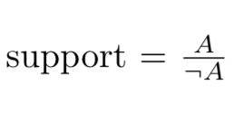
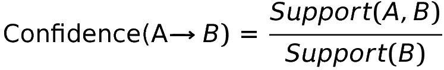
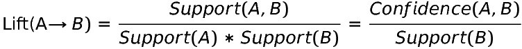

<br/><br/> 
 
 
Today, we’re going to learn about the **apriori machine learning algorithm**. Apriori, first proposed by [Agarwal and Srikant](https://www.it.uu.se/edu/course/homepage/infoutv/ht08/vldb94_rj.pdf) in 1994, is a type of Association Rule Mining algorithm that finds relationships within certain kinds of data and presents them as rules. Association Rule Mining is most commonly used in marketing, particularly in the context of shopping carts. This application area is formally known as “market basket analysis”.We’re going to use apriori to learn about the relationships between Oberlin College courses. If you want to follow along, check out my [GitHub repository](https://github.com/ElianaGrosof/OPrestissimoRecommendations).
### The data
Oberlin College students built a [handy website](http://oprestissimo.com/) that lets students evaluate different courses options by adding classes to a virtual cart. After some hard work and perseverance, we generated a [file](https://github.com/ElianaGrosof/OPrestissimoRecommendations/blob/master/data/converted_carts.csv) where each line contains a list of classes that a student considered taking at the same time. For example, if a student considered taking Economics 101 and Biology 100 in Fall 2020, we would have a line in our csv file that looks like:```shECON_101, BIOL_100```
### The algorithm — a brief overview
*Note: if you want to skip to the details, go to “algorithm — the details” section.*

In the broadest possible terms, the apriori algorithm takes a bunch of sets of items (known as *itemsets*), calculates some measures regarding the strength of relationships between items (*support, confidence, lift*), and presents those relationships as rules. 

Compared to some other machine learning algorithms, the results of apriori can seem a little anti-climactic, but the advantage is that you can easily understand the output. If this general approach is good enough for Amazon, it’s good enough for me.Let’s get into the details.
### Key Terms
*Itemsets*: an itemset is collection of related items. In our application, it is a list of classes that an Oberlin student considered taking in the same semester, represented as a “cart” of classes. Another example of an itemset is the items in a grocery store shopping cart, like “Bread, Eggs, Diapers”.
*Antecedent*: the first item in the itemset that I care about
*Consequent*: the second item in the itemset that I care about
_**Rule**_: antecedent → consequent relationship 
### Measures of Strength of Rules
*How strong is the relationship, really?*  

Assume we’ve divided our itemsets into lots of little rules. In this section, we want to understand how strong the rules are.Using our example from above, we know Economics 101 and Biology 100 are associated because a student thought about taking them at the same time. But, how strong is their relationship? Are they just friends, or are they something more? We’ll answer this question using 3 measures.The three main ways to understand how strong the relationship between items in an itemset are:
- Support
- Confidence
- Lift
### Support
Support tells us how often a given item was chosen. In our example, it tells us the absolute popularity of a class.Given class A and the rest of classes offered ~A (not A), the calculation for support is: 

  
#center

In our example, let’s say that Economics 101 was considered by 30 different students, and 1,000 other classes were considered by all students, including the students who thought about taking Economics 101. Then our support would be:

*support = 30/1000 = 0.03*

The higher the support, the more likely the item will appear in a given itemset.

### Confidence
Confidence is the likelihood that two items are in the same set. In our example, it’s the likelihood that if we considered taking Economics 101, then we would also consider Biology 100. So, given class A and class B:

 

### Lift
Lift gives us the best illustration of the relationship between two items by controlling for how popular the items are. Given class A and class B,
 


*Note: For more on the first equivalency, see [here](https://www.kdnuggets.com/2016/04/association-rules-apriori-algorithm-tutorial.html).* 

There are *3 cases* for lift:

* If *lift > 1*, then a student is *likely* to take Biology 100 at the same time as Economics 101. (The student will take class B, given that they are taking class A.) For example, if lift = 3.33, then a student is 3.33 times more likely to take Economics 101 and Biology 100 during the same semester than taking Economics 101 without Biology 100.
* If *lift < 1*, then the student is *unlikely* to take Biology 100 and Economics 101 together. (The student will not take class B, given that they are taking class A.)
* If *lift = 1*, there is *no relationship* between the two items. (It’s equivalent to saying that if a student thought about taking Economics 101, then they they definitely thought about taking Economics 101. While logically true, it’s practically useless.)

### Algorithm — the details

In this section, I’m going to explain the basic details of the algorithm in words, and then give some pseudocode to at the end to summarize it. 

In all implementations of apriori, you need to give the algorithm a minimum value for support, *min_sup*. You can also set the minimum confidence, if you wish.

* First, apriori finds all of the items that are at or above the minimum support. So if *min_sup* = 0.01, then the algorithm would only generate rules for items that occurred in at least 1/100 itemsets.
* Then, apriori finds all of the itemsets that have 2 items in it that occur frequently (the support is greater than or equal to *min_sup*). Then 3 items, then 4, etc., until it the algorithm runs out of frequent itemsets. At each step, it prunes away the items that occur together but not very frequently, to eliminate spurious relationships.
* Finally, apriori selects all the rules from the itemsets with the support value higher than the minimum threshhold and calculates and reports support, confidence, and lift.


[From Wikipedia’s page on the Apriori algorithm](https://en.wikipedia.org/wiki/Apriori_algorithm)

### Limitations
* The algorithm is *computationally expensive*, as it goes over the same data many times. The big-O is 2^|D|, where |D| is the total number of items present in all of the itemsets.
* It’s *susceptible to spurious correlations*, sometimes reporting relationships that should be ignored.

### My results — Oberlin College classes

For my final results, I eliminated all relationships with lift=1 and sorted my relationships by confidence and lift. I made the support very, very low (I was okay with finding the relationship even if the class only appeared in 3 carts). I chose to make the support very low because my data was incomplete, there are thousands of different classes offered at Oberlin, and only 1,500 students maximum using the OPrestissimo website in any given semester. You can see my results [here](https://github.com/ElianaGrosof/OPrestissimoRecommendations/tree/master/results).
